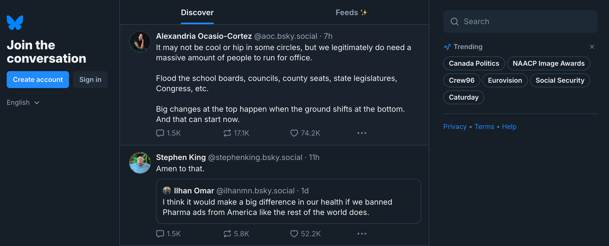
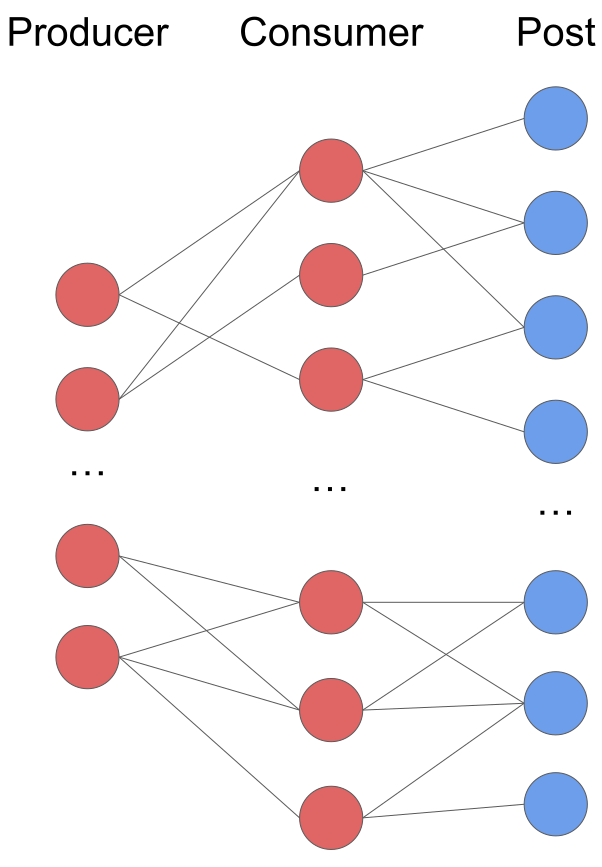
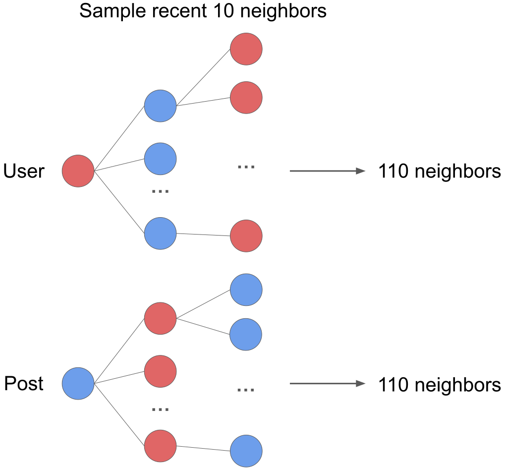
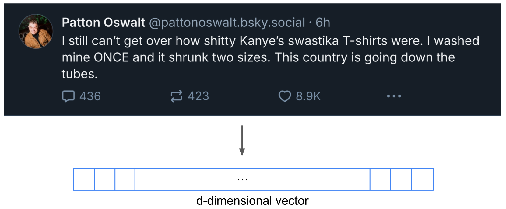
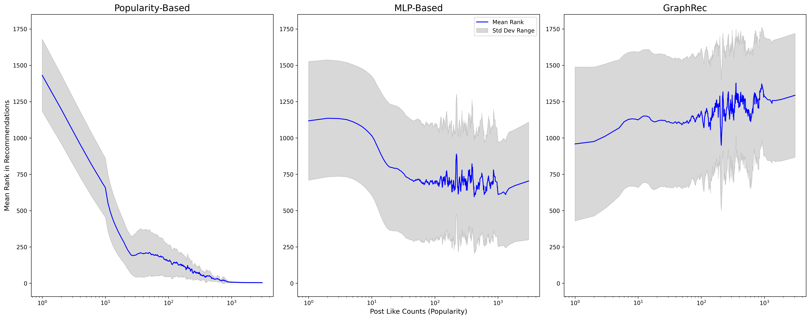

# Evaluating Graph Transformers for Scalable Social Media Recommendations

## Introduction

[Bluesky](https://bsky.app/) is a decentralized social media platform similar to Twitter, where the data on the network is open for access to everyone. 

### What is the problem?

Recommendation systems in social media platforms face unique challenges compared to traditional recommendation domains like movies or music. Unlike static user-item interactions, social media engagement is highly dynamic—users interact with new posts, trends emerge, and user preferences shift rapidly. Traditional recommendation techniques, such as collaborative filtering and matrix factorization, require periodic recomputation over the entire dataset, making them computationally expensive and difficult to scale for real-time recommendations.

Given these challenges, a scalable and decentralized recommendation system must adapt in real-time while maintaining computational efficiency.

### Why is this important?

Developing scalable recommendation models for social media platforms like Bluesky is crucial for several reasons:

- **Maintaining Engagement**: Users expect recommendations that reflect their evolving interests. A system that fails to adapt to dynamic user interactions risks decreased engagement and retention.
- **Computational Efficiency**: Traditional methods like matrix factorization require expensive periodic recomputation. Scalable models enable real-time updates, reducing computational overhead.
- **Real-Time Adaptability**: Social media trends shift quickly. A recommendation system should be able to incorporate new interactions without retraining the entire model.
- **Personalization at Scale**: Providing personalized recommendations across a growing user base requires efficient methods that can handle increasing data volume without significant delays.

<figure style="text-align: center;">
   
   <!-- <figcaption>Jina Embeddings encode the semantic structure of text data.</figcaption> -->
</figure>

By addressing these challenges, we aim to design a scalabel recommendation system that captures user interests in real time while balancing personalization measured by Mean Reciprocal Rate & Hit@10 and content diversity measured by Intra List Diversity. 

---

## Data Collection

Bluesky provides an open API that streams real-time data across the network. The dataset used in this project consists of two primary interaction types:
- Likes: Users engage with posts by liking them.
- Follows: Users follow others, forming a network of content producers and consumers.

   

We collect 6 months of Bluesky data from the beginning of the network and construct a consumer-producer bipartite follow graph. For training, we restrict like interactions to the period from 2023-06-07 to 2023-06-14. Users with ≥ 30 followers are defined as producers.

### Dataset Summary

| **Metric**       | **Count**  |
|------------------|-----------|
| Number of Users  | 23,765     |
| Number of Posts  | 365,314     |
| Number of Likes  | 1,042,739 |
| Number of Followings | 7,301,917 |

---

## Candidate Generation Using the Consumer-Producer Graph

Candidate generation is the first step in the recommendation pipeline, responsible for retrieving a small subset of relevant posts before ranking. Since directly computing recommendations for the entire dataset is infeasible, we use a consumer-producer bipartite graph to efficiently generate candidate posts.

### Structure of the Consumer-Producer Graph

- Users with more than 30 followers are considered as producers.
- Users act as consumers, interacting with posts from a set of producers.
- A directed edge from a user to a producer represents following behavior.

### Updating the Consumer-Producer Graph

We maintain dynamic user embeddings using two strategies:

1. **Periodic Batch Updates (Consumer Embeddings):**  
   Factorize the user-user follow matrix: $$F = CP^T$$ where:
   - $$d$$ is the embedding dimension.
   - $$C \in \mathbb{R}^{\lvert C \rvert \times d}$$ (consumers)  
   - $$P \in \mathbb{R}^{\lvert P \rvert \times d}$$ (producers)
   Given that follows are infrequent and high-signal (e.g., users with >= 30 followers), this batch computation is efficient.

2. **Real-Time Incremental Updates (Post Embeddings):**  
   Initialize each post embedding with its producer vector. When a user $$ k $$ interacts with post $$ j $$, update:
   $$
   V_j \leftarrow \frac{V_j + C_{k}}{||V_j + C_{k}||_2}
   $$
   This mechanism, similar to message passing in Graph Neural Networks, integrates user interactions immediately into the post representation.

    <object type="image/svg+xml" data="assets/pipeline1.svg" style="width: 100%; max-height: 500px;"></object>

This framework leverages high-signal user connections for efficient real-time recommendations, feeding both candidate generation and our GraphRec model.

<iframe src="assets/producer_embeddings.html" width="800" height="600" frameBorder="0"></iframe>

*An interactive plot demonstrating the initial producer embeddings.*

---

## GraphRec Ranking Model

After candidate generation, the retrieved posts are ranked using GraphRec. The primary goal of GraphRec is to adapt to dynamic user interests while maintaining computational efficiency.

### TL;DR

GraphRec enhances ranking quality by:
- Capturing Temporal Trends: Time encodings allow it to model how user preferences change.
- Leveraging Graph Information: Shared neighbors and graph embeddings improve personalization.
- Efficiently Processing Long Sequences: Patching reduces memory usage and speeds up computation.
- Utilizing Self-Attention: Transformers help learn complex dependencies between interactions.

Despite its computational complexity, GraphRec outperforms baseline recommendation models in terms of ranking precision and diversity, making it well-suited for decentralized social media platforms like Bluesky.

### Neighborhood Sampling

To efficiently process the vast number of interactions in social media graphs, GraphRec employs neighborhood sampling. Instead of considering the entire interaction history of a user, we select a fixed-size set of neighbors to ensure computational feasibility. By limiting the number of neighbors per node, we reduce memory consumption and improve computational efficiency, making the model suitable for large-scale deployment.

<!-- 

  

 -->

<figure style="text-align: center;">
   
   <!-- <figcaption>Jina Embeddings encode the semantic structure of text data.</figcaption> -->
</figure>

For a given user $$ u $$ interacting with a post $$ p $$, we sample the most recent 10 interactions along 2-hop neighbors. This means that each user’s and post's receptive field consists of:
- 10 direct neighbors (1-hop)
- 10 × 10 = 100 indirect neighbors (2-hop)

Thus, each interaction contains information from 10 + 100 = 110 neighboring nodes. This ensures that the model has sufficient contextual information while remaining computationally feasible.

The selection of recent neighbors follows:

   $$
   \mathcal{N}_\text{recent}(u, t) = \text{Top-}k(\mathcal{N}(u, t), \text{key}=t_j)
   $$

where:
- $$ \mathcal{N}(u, t) $$ represents the set of posts the user interacted with before time $$ t $$.
- The top-k most recent interactions are selected based on timestamps $$ t_j $$.

By prioritizing recent interactions, the model dynamically adapts to users' evolving interests, ensuring that recommendations remain relevant over time. The 2-hop expansion enables GraphRec to capture both direct and indirect influences, allowing it to effectively model homophily within the Bluesky platform - where users with similar interests tend to engage with overlapping content - while maintaining a manageable computational cost.

---

### Features Used in GraphRec

GraphRec integrates multiple feature types to enhance ranking performance. These features include:

1. **Post Raw Text Features:**  
    Each post is represented using [Jina Embeddings](https://huggingface.co/jinaai/jina-embeddings-v3), a pre-trained text embedding model optimized for large-scale text processing. These embeddings encode semantic relationships between posts, helping the model identify content that is similar in meaning even if the wording differs.

    <figure style="text-align: center;">
        
         <figcaption>Jina Embeddings encode the semantic structure of text data.</figcaption>
    </figure>

2. **User Features:**  
    Each user is represented using embeddings derived from the consumer-producer graph, capturing their historical preferences. Instead of treating users as isolated entities, this embedding considers who they follow and what content they interact with, ensuring a personalized recommendation experience.

3. **Temporal Encoding:**  
    Time plays a crucial role in social media recommendations, as user interests can shift rapidly. To incorporate this temporal information, we apply relative time encodings, which map the elapsed time since the last interaction into a continuous embedding space.

   $$
   \mathbf{X}_t = \sqrt{\frac{1}{d_T}} [\cos(w_1 \Delta t), \sin(w_1 \Delta t), ..., \cos(w_{d_T} \Delta t)]
   $$

   where $$ \Delta t $$ represents the time difference between the current and previous interaction, and $$ w_i $$ are learnable components that help capture periodic behaviors in user interactions.

4. **Shared Neighbors Feature:**  
    In social media, people with similar interests often interact with the same posts, and posts that cover related topics tend to attract overlapping audiences. GraphRec captures this behavior by analyzing shared neighbors between users and posts. Instead of only looking at direct interactions, it examines how a user and a post are connected through mutual engagement patterns.
    
    For example, if a user frequently interacts with posts that have also been engaged with by other users with similar interests, GraphRec considers these shared connections to refine recommendations. Similarly, if a post is liked by multiple users who have engaged with similar content in the past, the model recognizes that this post might also be relevant to other users within the same engagement network.
    
    By leveraging shared neighbor information, GraphRec improves its ability to recommend posts that align with user preferences, even when a direct interaction has not yet occurred. This helps the model surface relevant content.

---

### Patching for Scalability

A key challenge in graph-based ranking models is the high computational cost associated with long interaction histories. To address this, GraphRec applies a patching strategy, which splits interaction sequences into fixed-size segments before feeding them into the transformer.

Instead of processing full-length interaction histories, we reshape input sequences into smaller overlapping patches:

$$
\mathbf{X} \in \mathbb{R}^{k \times d} \to \mathbf{X}_\text{patched} \in \mathbb{R}^{\frac{k}{p} \times (p \cdot d)}
$$

where:
- $$ k $$ is the number of neighbors.
- $$ p $$ is the patch size, defining how many interactions are grouped together.
- $$ d $$ represents the feature dimension of each interaction.

By dividing long sequences into patches, GraphRec improves computational efficiency while maintaining the ability to learn meaningful user interaction patterns. This approach ensures that the model can process longer histories without excessive memory consumption, leading to better scalability.

---

### Transformer-Based Ranking

The final stage of GraphRec applies a transformer encoder to learn relationships between the sampled interactions. The transformer consists of:
1. Multi-Head Self-Attention to capture interaction dependencies.
2. Feed-Forward Networks (FFNs) to project features into the ranking space.
3. Residual Connections and Normalization to stabilize training.

#### Self-Attention Mechanism

Each patch is transformed into query (Q), key (K), and value (V) matrices:

   $$
   Q = X W_Q, \quad K = X W_K, \quad V = X W_V
   $$

where $$ W_Q, W_K, W_V $$ are trainable weight matrices. The self-attention score is computed as:

   $$
   \text{Attention}(Q, K, V) = \text{Softmax} \left( \frac{Q K^\top}{\sqrt{d_k}} \right) V
   $$

This allows the model to learn how different interactions influence each other. The softmax normalization ensures that the attention scores sum to 1, weighting important interactions higher.

#### Final Ranking Score

After passing through multiple self-attention layers, the final ranking score for a user-post pair is computed as:

   $$
   \hat{y} = W_2 \cdot \text{ReLU}(W_1 [\mathbf{H}_{user}; \mathbf{H}_{post}] + b_1) + b_2
   $$

where:
- $$ W_1, W_2 $$ are trainable weight matrices.
- $$ \mathbf{H}_{user}, \mathbf{H}_{post} $$ are the final user and post embeddings.

This ranking score represents the likelihood of a user interacting with a post, and the model is trained using Bayesian Personalized Ranking loss.

---

### Whole Pipeline

    <object type="image/svg+xml" data="assets/pipeline2.svg" style="width: 100%; max-height: 500px;"></object>

---

## Evaluation Metrics

A robust evaluation framework is crucial to assess the effectiveness of the recommendation model. In this study, we employ three key metrics: Mean Reciprocal Rank (MRR), Hit Rate@K, and Intra-List Diversity (ILD). Each of these metrics evaluates different aspects of the recommendation quality, including accuracy, ranking effectiveness, and content diversity.

### Mean Reciprocal Rank (MRR)

MRR evaluates the ranking quality by considering the position of the target post. Unlike Hit Rate, which only considers presence in the top-K, MRR rewards recommendations that rank relevant posts higher.

$$
\text{MRR} = \frac{1}{N} \sum_{i=1}^{N} \frac{1}{\text{rank}_i}
$$

where $$ \text{rank}_i $$ is the position of the target post in the recommended list. A higher MRR is desirable as it signifies that relevant posts are placed closer to the top of the ranked list, improving user engagement.

### Hit Rate@K

Hit Rate measures how often the correct post appears within the top-K recommendations. This metric is particularly useful in candidate generation and assessing whether relevant posts are surfaced to the user.

$$
\text{Hit}@K = \frac{1}{N} \sum_{i=1}^{N} \mathbb{1}(\text{target} \in \text{top-}K)
$$

where $$ \mathbb{1}(\cdot) $$ is an indicator function that returns 1 if the target post is within the top-K recommendations, otherwise 0. A higher Hit Rate@K indicates better performance, as it means that the relevant posts are consistently appearing in the top recommended results.

### Intra-List Diversity (ILD)

A major concern in recommendation systems is content redundancy, where users receive recommendations that are too similar to each other. ILD measures the diversity of the recommended list by evaluating the dissimilarity between recommended items.

$$
\text{ILD} = 1 - \frac{1}{N(N-1)} \sum_{i \neq j} \text{sim}(i, j)
$$

where $$ \text{sim}(i, j) $$ represents the similarity between posts $$ i $$ and $$ j $$. Higher ILD values indicate that the recommendations are more diverse, reducing echo chamber effects and increasing content exploration. In our evaluation, we compute ILD using cosine similarity between post text embeddings.

---

## Comparison Models

### Popularity-Based Recommendation

The popularity-based approach recommends Bluesky posts purely based on the number of likes a post has received. The assumption is that highly liked posts are more engaging and relevant to users, as users are influenced by social proof and tend to engage with posts that others have already liked. While this method is simple and computationally efficient, it has several limitations:

- **Lack of Personalization**: All users receive similar recommendations, disregarding individual preferences.
- **Cold Start Problem**: New posts with few or no likes struggle to gain visibility.
- **Temporal Bias**: Older posts with accumulated likes are favored over newer content, leading to potential stagnation in recommendations.

### MLP-Based Neighborhood Aggregation

Unlike the popularity-based approach, which solely relies on the number of likes, the MLP-based neighborhood aggregation method learns user preferences by leveraging temporal information and interactions. This method utilizes Multi-Layer Perceptrons (MLPs) to aggregate features from a user's local network, dynamically adapting to changing behaviors over time.

The architecture follows a temporal graph representation, where each node (representing a user or post) updates its embedding based on historical interactions. Instead of relying on multi-head attention mechanisms, this approach aggregates neighborhood information using mean pooling and MLP layers.

This approach is expected to improve upon the limitations of popularity-based methods by incorporating:
- **Temporal Dependencies**: Capturing how interactions evolve over time.
- **User-Specific Behavior**: Personalizing recommendations based on individual preferences.
- **Relational Information**: Leveraging a user's connections to enhance recommendation relevance.

The backbone of this model is based on [TGAT](https://arxiv.org/abs/2002.07962), where the multi-head attention mechanism has been replaced with an MLP to establish a baseline.

---

## Results

The performance of different recommendation models is compared using the above evaluation metrics. The table below presents the results for the Popularity-Based, MLP-Based, and GraphRec models.

| Model       | MRR ↑  | Hit@10 ↑ | ILD ↑  | Training Time (1 epoch) ↓ | Inference Time (s/user) ↓ |
|------------|------|----------|------|----------------------|--------------------------|
| Popularity | 0.0345 | 0.06     | **0.6243** | NA             | **0.118 sec**                 |
| MLP-Based  | 0.02 ± 0.001 | 0.03 ± 0.01     | 0.411 ± 0.008 | 10:48              | 0.215 sec                 |
| GraphRec   | **0.228 ± 0.005** | **0.235 ± 0.01**     | 0.55 ± 0.02 | 18:41              | 0.283 sec                 |

### Key Findings

- **Popularity-Based Model**:
  - Best ILD@10 score and fastest inference time, generating diverse recommendations efficiently.
    - High diversity arises because popular posts cover a wide range of topics across all users.
  - Weak ranking performance. Hit@10 of 0.06 signifies that only 6% of users receive the relevant recommendation in the top 10, showing poor personalization.

- **MLP-Based Model**:
  - Performs worse than the Popularity-Based model in all key metrics (MRR, Hit@10, ILD@10).
  - Higher training (10:48 per epoch) and inference time (0.215 sec/user), making it computationally expensive without notable performance benefits.

- **GraphRec**:
  - Highest MRR (0.228) and Hit@10 (0.235), excelling in ranking relevant items effectively.
  - ILD@10 (0.55) suggests a good balance between personalization and diversity.
  - Longer training and inference times but offers a strong trade-off between ranking accuracy and diversity.

These results highlight the trade-offs between ranking accuracy, diversity, and computational efficiency when selecting a recommendation model.

---

## Discussion

### How Do Different Models Rank Popular Posts?

- **Popularity-Based Model**:
  - Ranks highly liked posts at the top.
  - Limits visibility for niche content, favoring already popular posts.

- **MLP-Based Model**:
  - Partially mitigates the popularity bias.
  - The favoring trend begins to plateau once a post accumulates approximately 20 to 30 likes.

- **GraphRec**:
  - Does not inherently prioritize popular posts.
  - Surfaces both niche and well-liked posts when aligned with user interests.

- **Key Takeaways**:
  - Transformer-based architectures help mitigate bias toward popular content.
  - A balanced model should optimize ranking accuracy, diversity, and computational efficiency.

---

## Future Work

There are several areas for potential improvement in the current recommendation pipeline. One key focus is real-time inference optimization, as the GraphRec model currently has higher computational costs. Techniques such as model distillation, sparse attention mechanisms, or adaptive sampling could help reduce latency while maintaining accuracy.

Another direction for improvement is enhancing user embeddings to incorporate multi-interest representations. Users often engage with content spanning multiple topics, and capturing these diverse interests more effectively could improve personalization. A multi-vector user embedding approach could allow the model to better capture distinct user preferences.

Further, hybrid recommendation models that integrate transformers with message-passing neural networks (MPNNs) could be explored. While transformers excel at capturing global relationships, MPNNs are highly efficient for local neighborhood aggregation in graphs. A combination of these methods could offer a balance between accuracy, diversity, and computational efficiency.

Lastly, expanding the dataset to include additional interaction signals such as comment sentiment, content sharing patterns, and repost histories could enhance the robustness of the recommendation system. By incorporating richer behavioral data, the model could learn more nuanced user preferences and improve its predictive power in suggesting relevant posts.

---

## References

[1] Yu, Le, Leilei Sun, Bowen Du, and Weifeng Lv. 2023.  
*"Towards Better Dynamic Graph Learning: New Architecture and Unified Library."*  
Available at: [arXiv:2303.13047](https://arxiv.org/abs/2303.13047).
